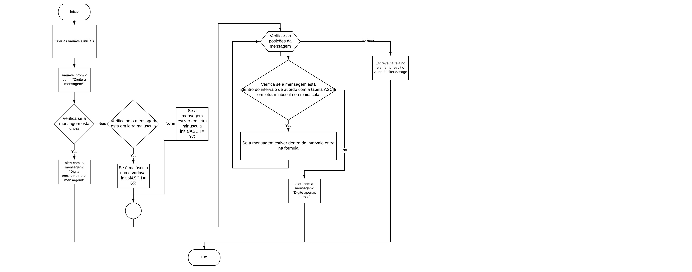
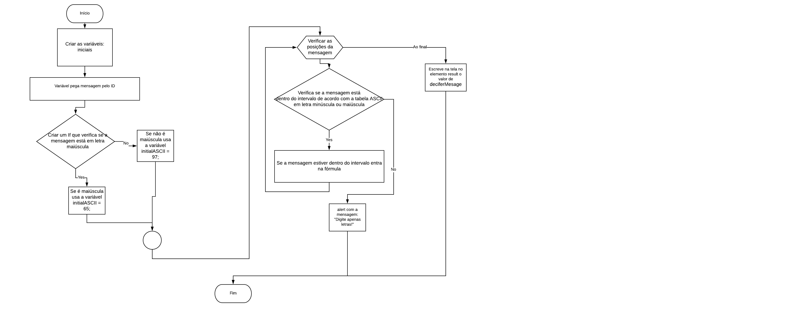

1. Criei a função Cifer e dentro as variáveis iniciais: ciferMesage = a vazia, result e initialASCII = 0;
2. Criei uma variável que faz um prompt pedindo que o usuário digite uma mensagem;
3. Fiz um if que verifica se a mensagem está vazia, caso ela esteja aparece um alert avisando o usuário.
4. Fiz outro if que verifica se a mensagem recebida está em letra maiúscula, se sim irá usar a variável inicial = 65 futuramente na fórmula para cifrar a mensagem,
se ela estiver em minúscula irá usar a variável inicial = 97 na fórmula;
5. Fiz um for com posição i inicial = a 0,  para que enquanto ela seja menor que o tamanho da mensagem ela adicione mais 1 para pegar as posições da mensagem.
6. Dentro do for criei um if que verifica  se a mensagem está dentro do intervalo de acordo com a tabela AIISC com letras maiúsculas ou minúsculas, se ela estiver a mensagem passa pela fórmula para ser cifrada. Se não estiver mostra um alert avisando ao usuário.
7. Ao final do for escreve/mostra na tela a mensagem cifrada. 
8. Chamo a função cifer.
9. Criei a função Decifer e dentro as váriaveis iniciais: mesage, deciferMesage = a vazia, result e initialASCII = 0;
10. Fiz outro if que verifica se a mensagem recebida está em letra maiúscula, se sim irá usar a variável inicial = 65 futuramente na fórmula para decifrar a mensagem,
se ela estiver em minúscula irá usar a variável inicial = 97 na fórmula;
11. Fiz um for com posição i inicial = a 0,  para que enquanto ela seja menor que o tamanho da mensagem ela adicione mais 1 para pegar as posições da mensagem.
12. Dentro do for criei um if que verifica  se a mensagem está dentro do intervalo de acordo com a tabela AIISC com letras maiúsculas ou minúsculas, se ela estiver a mensagem passa pela fórmula para ser cifrada. Se não estiver mostra um alert avisando ao usuário.
13. Ao final do for escreve/mostra na tela a mensagem cifrada. 
14. Chamo a função decifer.

# CifradeC-sar
